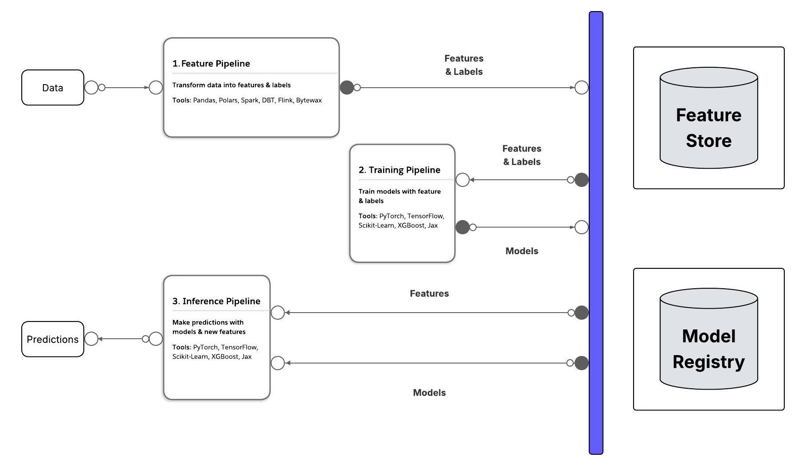

My LLM Engineering Lab
======================

Used to quickly prototype ideas before turning them into applications in python using Anaconda, JupyterLab, and Google Colab.

Inspiration from these recommended courses and books:
- [LLM Engineering: Master AI, Large Language Models & Agents by Ed Donner](https://www.udemy.com/course/llm-engineering-master-ai-and-large-language-models/)
- [AI-Agents: Automation & Business with LangChain & LLM Apps by Arnold Oberleiter](https://www.udemy.com/course/ai-agents-automation-business-with-langchain-llm-apps/)
- [LLM Engineer's Handbook by Paul Iusztin and Maxime Labonne](https://www.packtpub.com/en-us/product/llm-engineers-handbook-9781836200062)
- [The Machine Learning Solutions Architect Handbook](https://www.packtpub.com/en-us/product/the-machine-learning-solutions-architect-handbook-9781805124825)

**Table of content**
- [Data Science Environment Setup](#setup)
- [Patterns](#patterns)
- [Lab Projects](#lab-projects)
- [Flowise Projects](#flowise-projects)
- [HugglingFace Library Experiments](#hf-lib-exp)
- [Tools](#tools)
- [Skills Developed](#skills)

# Data Science Environment Setup

## Anaconda and JupyterLab

1. Clone the repo
    git clone https://github.com/jstoops/llm-engineer-lab.git
2. Download and install Anaconda: https://www.anaconda.com/download
3. Run Anaconda PowerShell Prompt
4. Nav to project directory and create an environment using a setup file:

    conda env create -f environment.yml
5. Download and install Ollama for open-source LLMs: https://ollama.com/
6. Create a .env file in project root with keys: OPENAI_API_KEY, ANTHROPIC_API_KEY, GOOGLE_API_KEY, DEEPSEEK_API_KEY, HF_TOKEN, LLAMA_CLOUD_API_KEY, etc.
7. Create keys/tokens and set to secret key values in .env
    - OpenAI API for GPT4o: https://platform.openai.com/settings/organization/api-keys
    - Google AI for Gemini API: https://ai.google.dev/gemini-api/docs
    - Anthropic for Claude Sonnet: https://console.anthropic.com/settings/keys
    - DeepSeek: https://platform.deepseek.com/api_keys
    - HuggingFace: https://huggingface.co/settings/tokens
    - LlamaCloud: Go to https://cloud.llamaindex.ai/ then API Keys
8. Activate environment:

    conda activate llms-eng
9. Verify correct python version is being used, e.g. 3.11.11:

    python --version
10. Open Jupyter environment:

    jupyter lab

Start environment after inital setup:
1. Run Anaconda PowerShell Prompt
2. Nav to project directory
3. Activate environment:

    conda activate llms-eng
4. Open Jupyter environment:

    jupyter lab

## Audio Setup

1. Download FFmpeg from the official website: https://ffmpeg.org/download.html
2. Extract the downloaded files to a location on your computer (e.g., C:\ffmpeg)
3. Add the FFmpeg bin folder to your system PATH:
    1. Right-click on 'This PC' or 'My Computer' and select 'Properties'
    2. Click on 'Advanced system settings'
    3. Click on 'Environment Variables'
    4. Under 'System variables', find and edit 'Path'
    5. Add a new entry with the path to your FFmpeg bin folder (e.g., C:\ffmpeg\bin)
4. Restart your command prompt, and within Jupyter Lab do Kernel -> Restart kernel, to pick up the changes
5. Open a new command prompt and run this to make sure it's installed OK ffmpeg -version

Check all required packages installed in JupyterLab:

    !ffmpeg -version
    !ffprobe -version
    !ffplay -version

## Google Colab Setup

1. Go to [Google Colab](https://colab.research.google.com/)
2. Click File->New notebook in Drive
3. From top right select downarrow next to Connect->Change runtime type, e.g. Python 3 on a CPU with High CPU RAM toggled off for cheapest option
4. Select Connect then once connected click on RAM & Disk to view Resources
5. Select folder icon on left to open file browser on local disk (temporary and wiped once finished using box)
6. Select key icon from left menu to open secrets for environment variables and toggle on the keys associated with the notebook
7. Click Share to share the notebook on Google Drive

## Clang Setup

1. Download Visual Studio 2022 Community edition: https://visualstudio.microsoft.com/downloads/
2. Run VisualStudioSetup.exe and select Individual components
3. Under _Compilers, build tools, and runtimes_ check `C++ Clang Compiler for Windows`
4. Click install
5. Add the Clang bin folder to your system PATH:
    1. Right-click on 'This PC' or 'My Computer' and select 'Properties'
    2. Click on 'Advanced system settings'
    3. Click on 'Environment Variables'
    4. Under 'System variables', find and edit 'Path'
    5. Add a new entry with the path to your Clang bin folder (e.g., C:\Program Files\Microsoft Visual Studio\2022\Community\VC\Tools\Llvm\bin)
6. Restart your command prompt, and within Jupyter Lab do Kernel -> Restart kernel, to pick up the changes
5. Open a new command prompt and run this to make sure it's installed OK

    clang --version

## Flowise Setup

### On Local Machine

See [Flowise repo readme](https://github.com/FlowiseAI/Flowise/blob/main/README.md) for detailsed steps and under Quick Start the versions of Node.js currently supported.

1. Install Node.js (v18, v19, or v20) & NPM: https://nodejs.org/en/download
    - Check version of node installed:

    node -v

    - To downgrade can use NVM for windows: https://github.com/coreybutler/nvm-windows or https://github.com/Schniz/fnm

2. Install Flowise:

    npm install -g flowise

3. Start Flowise:

    npx flowise start

    - Or start with username & password:

    npx flowise start --FLOWISE_USERNAME=user --FLOWISE_PASSWORD=1234

4. Go to UI at http://localhost:3000

Other useful commands:
- Update flowise:

    npm update -g flowise

### Run Flowise and AI Agents on Render

For details see:
- [Deploy Flowise to the cloud guide](https://docs.flowiseai.com/configuration/deployment)
- [Deploy Flowise on Render guide](https://docs.flowiseai.com/configuration/deployment/render)
- [How to configure environment variables for Flowise](https://docs.flowiseai.com/configuration/environment-variables)

1. Click fork on Flowise repo & confirm ok to create new repo on your personal GitHub: https://github.com/FlowiseAI/Flowise
2. Go to https://render.com/ & sign up or go to Dashboard
3. Click Add new->Web Service->Build & deploy from a Git repo then click Connect on your Flowise repo
4. Provide name, region, use main branch, Docker Runtime, select instance type/plan
5. Set environment variables: FLOWISE_USERNAME, FLOWISE_PASSWORD, NODE_VERSION=20.18.0
6. (if prod, non-free plan) Advanced->Add disk & specify:
    - Mount path=/opt/render/.flowise
    - Size=1GB
    - Additonal enviornment variables:

    DATABASE_PATH=/opt/render/.flowise
    APIKEY_PATH=/opt/render/.flowise
    LOG_PATH=/opt/render/.flowise/logs
    SECRETKEY_PATH=/opt/render/.flowise

7. Click Create Web Service
8. Go to URL created to login to Flowise

Other useful information:
- Paid plan needed to persist AI agents created else they'll be wiped when instance is spund down after 15 minutes of inactivity
- To update fork if behind click Sync fork->Update branch on your GitHub copy

# Patterns

## FTI Design Pattern

The feature/training/inference (FTI) architecture is the ML system pattern used as the core architecure in the LLM pipeline design. The FTI pipelines act as logical layers and this high-level architecture is language-, framework-, platform-, and inftrastructure agnostic.

The FTI pattern is followed to compute the features, train the model, and make predictions using 3 or more pipelines that each have a clearly defined scope and interface.

The data and feature pipelines scales horizontally based on CPU and RAM load, the training pipeline scales vertically by adding more GPUs, and the inference pipeline scales horizontally based on the number of client requests.

# Lab Projects

- [Product Pricer](https://github.com/jstoops/product-pricing-agent/blob/main/README.md): compares base LLMs as well as fine-tuned frontier and open-sources models to traditional machine-learning and human prediction of product prices based on a description with winner setup in an AI agentic framework that sends push notifications to you when a deal in a product is found.
- [AI Voice Assistant](https://github.com/jstoops/ai-voice-assistant/blob/main/README.md): uses the user's mic, desktop and webcam to answer questions on what they're currently working on.
- [Rental Investment Chatbot on Website](https://www.jdscraft.com/img/Rental-Investment-Chatbot-3.jpg): RAG chatbot uses a local LLM to embed a document on rental investing in a vector database and then a conversation QA chain to answer questions using it and embedded in [PropertyPulse](https://next-property-weld.vercel.app/).
- [Blog Standard AI SaaS](https://github.com/jstoops/blog-standard/blob/main/README.md): Next.js & Open AI / GPT apps using MongoDB, Auth0, & Stripe to purchase tokens used to generate blog posts & SEO friendly titles targeting keywords using OpenAI API.
- [Website Summarizer](https://github.com/jstoops/llm-engineer-lab/blob/main/projects/site-summary-require-js.ipynb): Give it a URL, and it will respond with a summary.
- [AI-Powered Marketing Brochures](projects/brochure-multi-prompt-spanish.ipynb): a product that builds a Brochure for a company to be used for prospective clients, investors and potential recruits when provided a company name and their primary website with language translation capabiltities.
- [AIs Having a Chat](https://github.com/jstoops/llm-engineer-lab/blob/main/projects/4-way-AI-conversation.ipynb): an adversarial conversation between Chatbots.
- [Store Chatbot](https://github.com/jstoops/llm-engineer-lab/blob/main/projects/chatbot.ipynb): a conversational AI with multi-shot prompting.
- [Airline AI Assistant](https://github.com/jstoops/llm-engineer-lab/blob/main/projects/airline-ai-assistant.ipynb): an AI Customer Support assistant for an Airline.
- [Meeting Minutes Program](https://github.com/jstoops/llm-engineer-lab/blob/main/projects/meeting-minutes.ipynb): generate meeting minutes from an audio recording of a meeting on your Google Drive.
- [Expert Knowledge Worker](https://github.com/jstoops/llm-engineer-lab/blob/main/projects/rag-knowledge-worker.ipynb): embeds documents in a vector datastore and uses RAG (Retrieval Augmented Generation) to ensure question/answering assistant is highly accuracy.

# Flowise Projects

Uses OpenAIs GPT 4 LLM, or open-source llama 3.1 LLM for privacy, to create blog posts, write scripts for YouTube videos, titles for social media posts, research Web about a lead, writes emails, load documents into a vector databases to use for providing detailed knowledge, analyze finances & stocks, visualize data, etc.

- [Social Media Strategy AI Agent](https://www.jdscraft.com/img/Social-AI-Agent.jpg): trained to generate blog posts on a specifc topic for a target audience, create a YouTube video script, attention grabbing titles, and social media posts to drive traffic to the blog post
- [Lead Generation AI Agent](https://www.jdscraft.com/img/Search-Mail-AI-Agent.jpg): searches the internet for information on potential clients, generates a profile and creates a personalized email message to send for generating leads.
- [Expert RAG App AI Agent](https://www.jdscraft.com/img/RAG-App-AI-Agent.jpg): putting data from PDFs, webpages or [converted to markdown](https://github.com/jstoops/llm-engineer-lab/blob/main/tools/llama-parse.ipynb) for better results into a vector data store, and automatic local text storage of blog post generated.
- [Personal Finance AI Agent](https://www.jdscraft.com/img/Personal-Finance-Data-AI-Agent.jpg): takes details on investment portfolio, uses a calculator to compute percentage distribution, writes python code to visualize investments, and writes a summary of the user's financial status integrating visual and calculations in the report.
- [Stock Analyzer AI Agent](https://www.jdscraft.com/img/Stock-Analyzer-AI-Agent.jpg): calls an API to get data about a stock and generates an analysis report on it.
- [Rental Investment Chatbot](https://www.jdscraft.com/img/Rental-Investment-Chatbot-1.jpg): takes a detailed rental investment knowledge base, uses a local LLM to embed the data in a vectore datastore, and uses the Groq API to call a more capable LLM to provide expert knowledge to user inquiries.

# HugglingFace Library Experiments

- [Pipelines](https://github.com/jstoops/llm-engineer-lab/blob/main/hf-libs/pipelines.ipynb): exploring the HuggingFace High Level API.
- [Tokenizers](https://github.com/jstoops/llm-engineer-lab/blob/main/hf-libs/tokenizers.ipynb): using different Tokenizers.
- [Models](https://github.com/jstoops/llm-engineer-lab/blob/main/hf-libs/models.ipynb): exploring the heart of the transformers library.

# Tools

- [Prompt Engineering for Creating AI Agents](https://www.jdscraft.com/img/Prompting-Team-AI-Agent.jpg): used to explain the app you want to create, and AI will generate the system prompt for each Worker.
- [Tech Question AI Assistant](https://github.com/jstoops/llm-engineer-lab/blob/main/tools/tech-questions.ipynb): takes a technical question, and responds with an explanation. Optimized for LLM and python code expertise.
- [Data Preparation for Training RAG Agent](https://github.com/jstoops/llm-engineer-lab/blob/main/tools/llama-parse.ipynb): uses LlamaIndex and LlamaParse to convert PDFs and other document types to markdown.
- [Improve Code Performance](https://github.com/jstoops/llm-engineer-lab/blob/main/tools/code-converter.ipynb): uses Frontier and open-source models to generate high performance C++ code from Python code.
- [Get GPU Info](https://github.com/jstoops/llm-engineer-lab/blob/main/tools/gpu-info.ipynb): code to display information about the GPUs that are currently running on a Notebook in Colab.
- [Image Generator](https://github.com/jstoops/llm-engineer-lab/blob/main/tools/image-generator.ipynb): uses Dall-E 2 or 3 to generate an image based on a user prompt.

# Skills Developed

- Confidently use the OpenAI & Ollama API including streaming with markdown and JSON generation
- Use the API for OpenAPI's GPT, Anthropic's Claude and Google's Gemini
- Constrast and contrast the leading Frontier LLMs
- Write code that interacts between multiple Frontier LLMs
- Describe transformers, tokens, context windows, API costs, etc
- Confidently code with APIs for Frontier Models GPT, Claude and Gemini
- Define Agentic Frameworks and Agentic Workflows in more detail

## Multi-Model AI Chatbot Assistant Development

Build multi-modal AI Chatbot Assistants with UI, Tools, and Agents for enhanced expertise:
- Implement customer support assistants with Chat UIs
- Create data science UIs in Gradio
- Provide context in a prompt including multi-shot prompting
- Use Agents to carry out sequential activities
- Create Function-calling Tools
- Implement multi-modal AI Assistants with Agents and Tools including an interactive UI

## HuggingFace Libraries

Navigate the HuggingPlace platform, run code in Colab and use HuggingFace pipelines, tokenizers and models:
- Find Models, Datasets and Spaces on the HuggingFace platform
- Use Google Colab to code on a high spec GPU runtime
- Use HuggingFace pipelines for a wide variety of inference tasks
- Use pipelines to generate text, images and audio
- Create tokenizers for models
- Translate between text and tokens
- Understand special tokens and chat templates
- Work with HuggingFace lower level APIs
- Use HuggingFace models to generate text
- Compare the results across 5 open source models
- Confidently work with tokenizers and models
- Run inference on open-source models
- Implement an LLM solution combining Frontier and Open-source models
- Build solutions with open-source LLMs with HuggingFace Transformers

## Comparing Open and Closed Source Models

Compare LLMs to identify the right one for the task at hand:
- Navigate the most useful leaderboards and arenas to evaluate LLMs
- Compare LLMs based on their basic attributes and benchmarks
- Give real-world use cases of LLMs solving commercial problems
- Confidently choose the right LLM for projects, backed by metrics

## Leveraging Frontier Models for High-Performance Code Generation in C++

Build a product that converts Python code to C++ for performance:
- Assess Frontier and Open-Source models for coding ability
- Use Frontier and open-source models to generate code
- Implement solutions that use Frontier and Open-source LLMs to generate code
- Use HuggingFace inference endpoints to deploy models on AWS, Azure, and GCP

## Evaluating LLM Code Generation Performance

Evaluating LLM performance by looking at Model-Centric vs Business-Centric metrics:
- Compare performance of open-source and closed source models
- Describe different commercial use cases for code generation
- Build solutions that use code generation for diverse tasks

## Retrieval Augmented Generation (RAG)

- Explain the idea behind RAG
- Walk through the high level flow for adding expertise to queries
- Implement a version of RAG without vector databases
- Explain how RAG uses vector embeddings and vector datastores to add context to prompts, define LangChain and read / split Documents
- Describe the LangChain framework, with benefits and limitations
- Create and populate a Vector Database with the contents of a Knowledge Base
- Use LangChain to read in a Knowledge Base of documents
- Use LangChain to divide up documents into overlaping chunks
- Convert chunks of text into Vectors using OpenAIEmbeddings
- Store the Vectors in Chroma, a popular open-source Vector datastore
- Visualize and explore Vectors in a Chroma Vector Datastore in 2D and 3D
- Create a Conversation Chain in LangChain for a chat conversation with retrieval
- Ask questions and receive answers demonstrating expert knowledge
- Build a Knowledge Worker assistant with chat UI
- Create a RAG Knowledge Worker using LangChain and Chroma
- Familar with LangChain's declarative language LCEL
- Understand how LangChain works behind the scenes
- Debug and fix common issues with RAG
- Create advanced RAG solutions with and without LangChain

## Fine-Tunning Frontier LLMs

- Using Datasets from HuggingFace hub
- Select, investigate and curate a Dataset
- Identify evaluations criteria for judging success
- Lay out a 5 step business strategy for selecting, training and applying an LLM
- Constrast the 3 techniques for improving performance
- Give common use cases for each of the techniques
- Curate and upload a dataset to HuggingFace that's ready for training
- Understand the process for Fine-Tuning a Frontier model

## Fine-Tuning & Training Open-Source LLMs

- Explain LoRA for fine-tuning Open Source models
- Describe Quantization and QLoRA for fine-tuning open-source models
- Explain how Training works
- Define and use key hyper-parameters for fine-tuning: r, alpha, target modules, quantization, dropout
- Define and use hyper-parameters for training: epoch, batch size, learning rates, gradient accumulation, optimizer
- Set up a Supervised Fine Tuning Trainer
- Train proprietary LLM to solve a business problem
- Monitor progress in Weights & Biases
- Save versions of trained models in HuggingFace hub
- Run inference on a QLoRA fine-tuned model

# Strategy to Find Best Solution to Business Problems

- Follow a 5 step strategy to solve problems
- Understand the role of a baseline model
- Dataset curation
- Making baseline models with traditional ML and Frontier solutions
- Understand when and why to Fine-Tuning a Frontier model
- Select an open-source Base Model to use to compete with the Frontier
- Compare instruct and base base variants for task
- Evaluate a base model against a business objective
- Define and choose hyper-parameters for fine-tuning and training
- Explain ways to train more quickly at lower costs
- Confidently carry out the end-to-end process for selecting and training open-source models to solve a business problem

# Productionize Solutions for Commercial Problems

- Build a framework to solve commercial problems using a Frontier model
- Create a traditional ML solution with feature engineering, bag of words, word2vec and linear regression
- Apply more advanced NLP techniques including SVR and Random Forest
- Run test datasets against GTP-4o-mini, GPT-4o and Claude-3.5-Sonnet
- Create a fine-tuning dataset and run fine-tuning
- Test a fine-tuned Frontier model
- Deploy customized models behind an API
- Create production products that use custom Models
- Create an end-to-end solution to commercial problems with groundbreaking LLMs
- Use Modal, the serverless platform for AI, to run code remotely
- Deploy LLMs behind an API in the cloud
- Create Agents that are incorporated into autonoumous Agentic AI solutions
- Build ensemble models with high level of expertise
- Deliver production ready code to call a number of models
- Deploy multiple models to production including proprietary LLMs on Model, a RAG workflow with Frontier models, and ML models
- Use Structured Outputs to ensure frontier models respond based on a spec
- Build an Agentic Framework that sends push notifications
- Build Agentic Workflows with Planning, Memory, Database, and multiple Agents collaborating to solve complex tasks